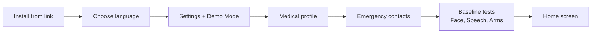
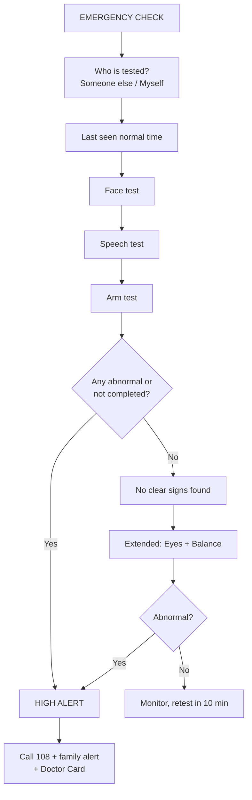

# GoldenHour — Product Requirements Document (PRD)

> Converted from docs/PRD.pdf by text extraction. If this file and the PDF disagree, the PDF wins. NOTE: the supplied PDF ends at page 45, part-way through Section 16 (constraint C26). Sections 17–21 and the "Setup and deployment steps (Part 1)" referenced elsewhere are NOT in the supplied PDF.

## 1. Summary

GoldenHour is an offline, AI-powered stroke screening app that turns any family member into a first responder in about 60 seconds. It uses the phone's camera, microphone and motion sensors to run the doctor-standard BE-FAST stroke check, then alerts 108, family and the hospital.

**Pitch line:** "GoldenHour doesn't ask 'is this face normal?' It asks 'is this still Amma's face?'"

| Item | Detail |
|---|---|
| Product name | GoldenHour |
| Document type | Product Requirements Document (PRD), implementation-ready |
| Version | 1.0 |
| Event | iQOO Hackathon 2026, Hyderabad City Battle (26–27 Sep 2026, 30 hours) |
| Track | HealthTech (AI-powered healthcare, wellness, fitness or mental health) |
| Stage covered | Part 1: PWA prototype for idea submission. Part 2: native Android app built on-site. |
| Primary device | iQOO 15 (provided on-site). Any Android phone with Chrome for the Part 1 prototype. |
| Readers | Developers, Claude Code sessions, teammates, mentors, reviewers |

**What the product does, in one flow:**

1. The helper opens GoldenHour when someone suddenly looks unwell.
2. The app records when the person was last seen normal.
3. It runs three quick tests: Face (camera), Speech (microphone), Arm (motion sensors).
4. If any test is abnormal, it shows a HIGH ALERT and helps call 108.
5. It alerts family by SMS/WhatsApp with live location.
6. It prepares a Doctor Handoff Card for the emergency room.

**How to read this PRD:** Sections 2–7 explain why and what. Sections 8–13 explain how it works. Sections 14–15 are the build guide. Sections 16–18 list every rule and limit. Sections 19–21 cover testing, demo, submission and the on-site plan.

**Important:** GoldenHour is a screening aid that tells people to get to a hospital now. It is not a diagnostic device and never says "you are fine".

## 2. The Problem

Most stroke patients in India reach hospital too late for the treatment that could save them. The treatment exists; the failure happens in the first minutes at home.

| Fact | Number | Source |
|---|---|---|
| Strokes in India per year | More than 1.5 million | Tezpur study, PMC |
| Patients reaching hospital within the golden hour (60 min) | 5.3% | South First, registry study |
| Patients reaching hospital within the 4.5-hour treatment window | 20.1% | South First |
| Patients arriving more than 24 hours after symptoms began | 37.8% | South First |
| Ischaemic stroke patients given clot-busting treatment (thrombolysis) | 4.6% | South First |
| Patients dead at 3 months | 27.8% | South First |
| Patients with significant disability at 3 months | 29.7% | South First |
| Brain cells lost per minute during a stroke | About 19 lakh (1.9 million) neurons | South First |

**Root cause: recognition, not treatment.** Experts cite poor knowledge of early stroke signs and of the need to seek help urgently (Journal of Neurosciences in Rural Practice). A typical story: a grandmother's face droops slightly, her speech slurs, the family thinks she is tired and waits until morning.

**Why checking by eye is not enough.** The standard bedside checks are qualitative. They have high specificity but low sensitivity, 11% to 33% (iPronator study, PLOS One). Mild weakness is easy to miss.

**The insight.** Everyone in the room already carries a device that can measure the face, voice and arm precisely: the phone. GoldenHour turns it into the measuring instrument.

## 3. Goals, Non-Goals and Success Criteria

The prototype must prove that a phone can detect stroke warning signs and move a family to act within minutes.

### Goals

1. Detect face droop, arm weakness and speech problems using phone sensors and AI.
2. Turn any abnormal result into immediate action: call 108, alert family, prepare the doctor card.
3. Work offline for all tests, so it works in villages and at 2 AM.
4. Be usable by a panicking, non-technical family member, guided by voice in Telugu, Hindi or English.
5. Score well on all five hackathon judging criteria and the phone-feature requirement.

### Non-goals (not in this prototype)

- Diagnosing stroke type (clot vs bleed). Only a hospital CT scan can do that.
- Replacing 108, doctors or hospitals.
- Continuous background monitoring or automatic fall detection.
- Play Store release, backend servers, user accounts or cloud storage of health data.
- Claiming clinical accuracy numbers. Thresholds are calibrated on healthy volunteers only.

### Success criteria for the Part 1 prototype

| # | Criterion | How we check |
|---|---|---|
| SC1 | App installs from a link and opens full-screen from a home-screen icon | Install on a teammate's phone from the GitHub Pages link |
| SC2 | Face test flags a simulated one-sided smile and passes a normal smile | Calibration runs (Section 19) |
| SC3 | Arm test flags a deliberately sagging arm and passes a steady arm | Calibration runs |
| SC4 | Any abnormal test leads to the HIGH ALERT screen within 1 second | Manual test |
| SC5 | Call, SMS and WhatsApp buttons open pre-filled with the demo number and live location | Manual test in Demo Mode |
| SC6 | Doctor Handoff Card shows last-known-well time, test results and medical profile | Manual test |
| SC7 | All tests work in airplane mode after the first online load | Airplane-mode test |
| SC8 | 60–90 second demo video recorded and linked in the deck | Deliverable check |
| SC9 | No real 108 call, no real patient data and no API key in the code, at any time | Code review + team rule |

## 4. Hackathon Context and Rules

The product is designed around the iQOO Hackathon 2026 rules: phone-first, AI-first, judged on the iQOO phone. Sources: the organisers' WhatsApp FAQ, iqoo.reskilll.com and the Reskilll blog.

### Event facts

| Item | Detail |
|---|---|
| Our city battle | Hyderabad, 26–27 Sep 2026, 30 hours, on-site |
| Other city battles | Bengaluru 29–30 Aug, Pune 5–6 Sep, Chennai 12–13 Sep |
| Grand Finale | Bengaluru, 9–11 Oct 2026, 48 hours |
| Prize pool | ₹40,00,000 total; ₹6L per city |
| Who advances | Top teams per city (blog: 3 student + 3 professional) get direct Grand Finale entry |
| Online round | Only one: idea/prototype submission, then shortlisting |
| Submission deadline | City-wise. Check the Hyderabad deadline on the dashboard. |
| Submission format | A deck with an idea brief is enough. Prototype optional but helps. No fixed template. Editable until the deadline. |
| Expected build | A very rudimentary prototype, not the full product |
| Results | Shortlisted teams notified by email |
| Team size | 1 to 3 builders |
| Categories | Students and working professionals compete separately; teams cannot mix. Recent unemployed graduates count as professionals. |
| Devices | iQOO 15 given to each shortlisted participant on-site. Final demos must run on it. |
| Form factor | App or web, any form, but phone-first. Software preferred over hardware. |
| AI credits | OpenRouter credits provided during the hackathon (not before) |
| Logistics | Food provided. Bring your own laptop. Travel and stay not covered. |
| Venue | Shared only with shortlisted teams |

### Judging criteria (from the organisers)

| # | Criterion | How GoldenHour meets it |
|---|---|---|
| 1 | Problem clarity and relevance | One strong stat: only 1 in 5 stroke patients reaches hospital in time |
| 2 | Novelty and originality | Offline, family-operated, personal baseline, full BE-FAST, Indian languages, 108 routing (Section 6) |
| 3 | AI-first thinking | AI does perception (face, speech) and communication (LLM); baseline anomaly detection |
| 4 | iQOO device fit | 7 phone features plus iQOO 15 hardware mapping (Section 10) |
| 5 | Feasibility and impact | Proven components; impact measured in lives and disability prevented |

### Scoring rubric published on the Reskilll blog (on-site judging)

| Criterion | Weight | Measured by |
|---|---|---|
| End product quality | 30% | Jury |
| Novelty and impact | 20% | Jury |
| Creative phone use (camera, voice, on-device AI) | 15% | HackTracker device data |
| Technical depth | 15% | Jury |
| Office Kit usage | 10% | HackTracker device data |
| Demo and presentation | 10% | Jury |

### Red Light / Green Light format

- Green Light: phone and laptop can both be used freely.
- Red Light: phone only. The laptop can be used only through iQOO Office Kit (screen mirror, remote control, file transfer, clipboard).
- About 55% of build time is Red Light and 45% Green Light (blog).
- HackTracker records phone usage and Office Kit usage automatically; it cannot be faked in the pitch.

**Brownie points:** a local or open-source model at the core earns extra credit across all tracks. Cloud-only AI and web apps that ignore phone features lose points.

## 5. Users and Personas

GoldenHour has five kinds of users; only the Helper and Setup User touch the app directly. All names below are fictional and must be used in demos instead of real people.

| Persona | Who (fictional example) | Situation | What they need from GoldenHour |
|---|---|---|---|
| Patient | Lakshmi, 68, Hyderabad, diabetic, on BP medicine | Suddenly unwell; may be confused, weak or unable to speak | To be tested quickly and gently, with simple spoken instructions |
| Helper | Her daughter-in-law at home, or a neighbour | Panicking, not medical, may not read English | Big buttons, voice guidance in Telugu, a clear "call 108 now" decision |
| Setup User | Her son Ravi, visiting from Bengaluru | Sets the app up while Lakshmi is healthy | Easy profile, contacts and baseline setup in under 5 minutes |
| Remote Family | Ravi, back in Bengaluru | Far away when it happens | An instant SMS: what happened, where she is, which hospital |
| Doctor / ER staff | Emergency doctor at the receiving hospital | Minutes matter; no time to install apps | Last-known-well time, test results, diabetes and blood-thinner status at a glance |

**Future users (roadmap, not built now):** ASHA workers and old-age-home staff screening many elderly people; 108 paramedics receiving the card before arrival.

### Design rules that follow from these users

- Assume the helper is scared and in a hurry: one decision per screen, large text, high contrast.
- Assume the patient may not cooperate: an unfinished test counts as a warning sign, never as a pass.
- Assume no internet: every test and the decision work offline.
- Assume limited English: every instruction is shown on screen and spoken aloud in the chosen language.

## 6. Positioning and Differentiation

The phone-based stroke check is a clinically tested concept; GoldenHour's novelty is making it offline, personal and usable by Indian families. We say this openly in the deck, because judges may already know the prior work.

### Prior work (proves feasibility)

| Prior work | What it showed | Source |
|---|---|---|
| FAST.AI (Neuronics Medical, UCLA-linked) | 269 acute stroke patients. Facial asymmetry detection: 99.42% sensitivity, 93.67% specificity. Arm weakness: 71.42% sensitivity. | Healio |
| FAST.AI limitations | Test data sent to a server for analysis; screenings run by neurologists, not families | Inside Precision Medicine, India.com |
| iPronator (PLOS One, 2012) | Handheld-device accelerometer app measured arm drift in 10 acute stroke patients vs 10 healthy controls | PLOS One |
| NeuFun-TS (BMC Neurology, 2025) | Smartphone accelerometer sway and drift tests work as measures of neurological disability | BMC Neurology |

### What is new in GoldenHour

| # | Differentiator | Why it matters |
|---|---|---|
| D1 | Fully offline, on-device AI | Works without internet; health data never leaves the phone |
| D2 | Built for families, voice-guided in Telugu/Hindi/English | The person present in the first minutes is a relative, not a neurologist |
| D3 | Personal baseline | Compares against the person's own healthy face, voice and arm, reducing false alarms from natural asymmetry |
| D4 | Full BE-FAST (core + extended check) | Catches balance and vision strokes that plain FAST misses |
| D5 | Connected action | 108 call, family SMS with location, hospital call and a Doctor Handoff Card in one flow |

**Positioning statement (use in deck):** "Proven in hospitals. Never put in the hands of Indian families. Until now."

**Medical positioning (mandatory wording):** "A screening aid that prompts people to seek emergency care. Not a diagnostic device."

## 7. Scope: Part 1 and Part 2

We build GoldenHour in two stages of the same product: a PWA prototype now for the idea submission, and a native Android app on-site. Both use the same models, logic and thresholds, so Part 1 work carries straight into Part 2.

| | Part 1: PWA prototype | Part 2: Native Android app |
|---|---|---|
| When | Before the submission deadline | On-site, 26–27 Sep (30 hours) |
| Purpose | Prove the idea works; get shortlisted | Full product for city battle judging |
| Tech | HTML + JavaScript, runs in Chrome, installable as an app | Kotlin + Jetpack Compose |
| Device | Any Android phone with Chrome | iQOO 15 provided at the venue |
| AI | MediaPipe + Whisper in the browser; free LLM API | MediaPipe + Whisper + Gemma on-device (NPU where supported); OpenRouter credits |
| Calls and SMS | Opens dialer / SMS app pre-filled; user taps to confirm | One-tap direct call; SMS sent automatically |

**Why two parts.** A web prototype runs on any phone with no build setup, which is ideal for proving the idea. A browser cannot fully run large models on the NPU, place calls directly or send SMS silently; only a native app can, so the final product is native.

### Priority levels

- P0: must be in the Part 1 submission.
- P1: should be in the Part 1 submission.
- P2: build in Part 1 once all P0 and P1 features are stable.
- P3: on-site only (needs the native app or the iQOO 15).

### Feature list

| ID | Feature | Priority | AI involved |
|---|---|---|---|
| F1 | PWA shell, one-tap install, offline support | P0 | No |
| F2 | Settings and Demo Mode (safe demo phone numbers, API keys, language) | P0 | No |
| F3 | Medical profile | P0 | No |
| F4 | Emergency contacts | P0 | No |
| F5 | Personal baseline recording | P1 | Yes (anomaly detection) |
| F6 | Last-known-well time capture | P0 | No |
| F7 | Face test (droop) | P0 | Yes (on-device vision model) |
| F8 | Speech test (slurring, wrong words) | P1 | Yes (on-device speech model) |
| F9 | Arm test (pronator drift) | P0 | Signal processing + baseline |
| F10 | Decision engine | P0 | No (rule-based by design) |
| F11 | Alert screen and 10-second family-alert countdown | P0 | No |
| F12 | Emergency actions: call, SMS, WhatsApp, live location | P0 | No |
| F13 | Doctor Handoff Card (QR and share as P1) | P0 | No |
| F14 | AI explanation and doctor summary, with template fallback | P1 | Yes (LLM) |
| F15 | Voice guidance (text-to-speech) | P1 | No |
| F16 | Developer and calibration panel | P1 | No |
| F17 | Eyes test (gaze and side vision) | P2 | Yes (on-device vision model) |
| F18 | Balance test (postural sway) | P2 | Signal processing |
| F19 | Nearest stroke-ready hospital | P2 | No |
| F20 | Native app port, on-device Gemma, NPU, direct call and auto-SMS | P3 | Yes |
| F21 | iQOO-specific extras: Monster Halo status light (if accessible), max-brightness mode | P3 | No |

**Out of scope for both parts:** backend servers, user accounts, a family "guardian" app, hospital dashboards, ABHA integration, Play Store release. These are roadmap items (Section 21).

## 8. End-to-End System Flow

GoldenHour has two journeys: a one-time Setup while the person is healthy, and the Emergency Check when something seems wrong. The Emergency Check's core tests take about 60 seconds.

### Journey A: Setup (once, about 5 minutes)



The Setup User (e.g. Ravi) installs the app on the patient's phone, fills in the profile and contacts, and records the patient's healthy baseline. Baseline can be skipped and done later; tests then fall back to general thresholds.

### Journey B: Emergency Check



A red "EMERGENCY NOW" button on every screen jumps straight to HIGH ALERT, skipping any remaining tests.

### Step-by-step (what the app does at each step)

| Step | Screen | Who acts | What happens | Typical time |
|---|---|---|---|---|
| 1 | Home | Helper | Taps the large EMERGENCY CHECK button | 2 s |
| 2 | Who is tested | Helper | Chooses "Someone else (I am helping)" or "Myself". Sets camera: rear for helper, front for self. | 3 s |
| 3 | Last seen normal | Helper | Picks a quick option ("Just now", "30 min ago", "1 hr ago", "On waking", "Unknown") or a clock time | 5 s |
| 4 | Face test | Patient + Helper | Neutral face 2 s, then big smile 3 s; app scores asymmetry | 10 s |
| 5 | Speech test | Patient | App speaks a sentence; patient repeats it; app scores it | 15 s |
| 6 | Arm test | Patient | Phone on open palm, arm straight out, eyes closed, 10 s per arm, left then right | 30 s |
| 7 | Decision | App | Rule engine checks results (Section 11) | under 1 s |
| 8a | HIGH ALERT | Helper | Call 108; 10-second countdown then family SMS; Doctor Card ready | immediate |
| 8b | No clear signs | Helper | Offered the extended check (Eyes + Balance). Told to call 108 anyway if still worried; retest in 10 minutes. | 60 s if chosen |
| 9 | Doctor Card | Helper, then doctor | Shown at the ER, or shared by WhatsApp; QR works offline | at hospital |

### Rules that apply throughout the flow

- The call button and EMERGENCY NOW button are visible on every screen of the check.
- A test the patient cannot finish (confused, unconscious, cannot hold the phone, no smile, no speech) counts as abnormal.
- The app never says "you are fine" or "no stroke". The normal result says "No clear warning signs found".
- Voice guidance speaks every instruction; the same text is shown on screen.
- The screen stays on for the whole check (Wake Lock).

## 9. Screens and UI Requirements

The app has 18 screens, designed for a scared, non-technical helper holding the phone with one hand. Every screen follows the global UI rules below.

### Global UI rules

| Rule | Requirement |
|---|---|
| Text size | Body at least 20 px; headings at least 28 px; test instructions at least 24 px |
| Buttons | At least 56 px tall, full width for primary actions; touch targets at least 48 × 48 px |
| Colour | High contrast (WCAG AA). Red #D32F2F = emergency, green = normal, amber = warning. Never colour alone: always a word too ("ABNORMAL"). |
| Orientation | Portrait only |
| Language | Every string comes from the language file (English, Hindi, Telugu); switchable in Settings |
| Voice | Every instruction also spoken aloud (F15), with a mute button |
| Screen | Kept awake during tests and alerts (Wake Lock); max brightness on alert and Doctor Card screens where supported |
| Demo banner | While Demo Mode is on, a yellow banner at the top of every screen: "DEMO MODE — calls go to [name], not 108" |
| Emergency access | During the check, a top bar shows progress (e.g. "Test 2 of 3") and a red EMERGENCY NOW button |

### Screen list

| ID | Screen | Key elements | Behaviour |
|---|---|---|---|
| S1 | Install page (browser only) | App name, one-line purpose, big "Install GoldenHour" button, fallback text "Tap ⋮ → Install app" | Hidden when opened as an installed app. Shows "Please open in Chrome" if the install event never fires. |
| S2 | Language | English, `[NOT RECOVERABLE FROM PDF TEXT — see docs/PRD.pdf]` (Hindi label), `[NOT RECOVERABLE FROM PDF TEXT — see docs/PRD.pdf]` (Telugu label) buttons | First launch only; changeable in Settings |
| S3 | Settings | Demo Mode (locked on), demo emergency number, demo hospital number, LLM provider + API key fields, voice on/off, developer mode, reset all data | See F2 for validation |
| S4 | Medical profile | Name, age, sex, blood group, diabetic, BP medicine, blood thinners, allergies, other conditions | Save to storage; all optional except name |
| S5 | Emergency contacts | List + Add/Edit: name, relation, phone, primary yes/no, lives nearby, language | At least 1 contact before an alert can send; see F4 |
| S6 | Baseline | Intro, then Face, Speech, Left arm, Right arm in baseline mode, then summary | Stores healthy values (F5) |
| S7 | Home | Huge EMERGENCY CHECK button, red EMERGENCY NOW button, setup checklist (profile, contacts, baseline), settings icon | Checklist items link to S4–S6 |
| S8 | Who is tested | "Someone else (I am helping)" / "Myself" | Sets rear or front camera |
| S9 | Last seen normal | Quick buttons: Just now, 30 min ago, 1 hr ago, On waking, Unknown; plus a time picker | Stores a timestamp or "unknown" (F6) |
| S10 | Face test | Camera preview, oval face guide, instruction, countdown, quality hint ("Face the camera") | F7 |
| S11 | Speech test | Sentence in large text, spoken prompt, listening indicator, level meter | F8 |
| S12 | Arm test | Illustration of phone on palm, arm label (LEFT / RIGHT), countdown, live tilt graph | F9 |
| S13 | HIGH ALERT | Red full screen, "Possible stroke signs. Call 108 now.", big CALL button, family-alert countdown with Cancel, WhatsApp button, Doctor Card button, hospital button (P2), AI explanation, diabetic sugar prompt if relevant | F11, F12 |
| S14 | No clear signs | "No clear warning signs found", "If you are still worried, call 108", buttons: Extended check, Retest in 10 min, Call | Never says "you are fine" |
| S15 | Eyes test | Gaze step with camera; side-vision dots step | F17 |
| S16 | Balance test | Safety question first ("Is someone standing beside them?"), then 30 s sway recording | F18 |
| S17 | Doctor Handoff Card | Card layout (F13), QR code, Share button, max brightness | F13 |
| S18 | Developer panel | Raw metrics of the last test, thresholds in use, export CSV | F16; hidden unless developer mode is on |

## 10. Feature Specifications

Each feature below states what it is, why it is needed, how the user interacts with it, how to implement it, and how to know it is done. Thresholds marked "starting value" must be tuned during calibration (Section 19).

### F1. PWA Shell, One-Tap Install and Offline Support (P0)

**What:** GoldenHour is a website that installs like an app: its own home-screen icon, full-screen with no browser bar, and working offline.

**Why:** Judges should see an app, not a website. Offline support is essential because strokes happen where there is no internet.

**User interaction**

1. The user taps the shared link. It is an Android intent link that forces Chrome (see below).
2. Page S1 shows a large "Install GoldenHour" button.
3. The user taps it, then taps Install on Android's popup.
4. The GoldenHour icon appears on the home screen. Tapping it opens the app full-screen.

**Implementation**

- **Hosting:** GitHub Pages (free HTTPS). HTTPS is required: camera, microphone, motion sensors and service workers do not work on plain HTTP or local files.
- **Manifest (`manifest.json`):** `name` "GoldenHour", `short_name` "GoldenHour", `start_url` "./", `display` "standalone", `orientation` "portrait", `background_color` "#ffffff", `theme_color` "#d32f2f", icons 192 × 192 and 512 × 512 PNG. Linked with `<link rel="manifest" href="manifest.json">`.
- **Service worker (`sw.js`):** on install, cache every app file, every vendored library, the MediaPipe WASM files and `face_landmarker.task`. On fetch, serve from cache first, then network. Name the cache with a version (e.g. `goldenhour-v7`) and bump it on every deploy; delete old caches on activate.
- **Vendoring:** store MediaPipe Tasks Vision (JS + WASM folder), the face model, Chart.js and the QR library inside the repo under `/vendor` and `/models`, not only on a CDN, so they are cached for offline use. Pin exact library versions.
- **Whisper model (F8):** Transformers.js caches model files in the browser automatically on first load. The app must be opened online once and the speech test run once before offline use.
- **Install button:** listen for `beforeinstallprompt`, call `preventDefault()`, keep the event, show the button; on tap call `prompt()`. Hide S1 when `matchMedia("(display-mode: standalone)")` matches.
- **Chrome-forcing link:** share `intent://<user>.github.io/goldenhour/#Intent;scheme=https;package=com.android.chrome;end` (truncated in the PDF; completed with the standard suffix) instead of the plain URL. iQOO phones may default to vivo's browser, and some apps open links in their own mini-browser; the install button only works in Chrome (or Samsung Internet).
- **Update prompt:** when a new service worker is waiting, show "Update available — tap to reload".

**Acceptance criteria**

- Installs from the intent link on an Android phone in 3 taps or fewer.
- Opens full-screen from the icon with no address bar.
- In airplane mode (after one online load), the app opens and the Face and Arm tests run.

**Edge cases and limits**

- Chrome may delay the install popup until the user has interacted with the page briefly. The fallback text "Tap ⋮ → Install app" is always shown under the button.
- Fully silent installation from a link is impossible on Android; every install needs user confirmation.
- iPhone is out of scope.

### F2. Settings and Demo Mode (P0)

**What:** A Settings screen (S3) that holds language, voice, LLM keys, developer mode and the Demo Mode phone numbers.

**Why:** Demo Mode guarantees that no test, rehearsal or demo ever dials the real 108 or alerts a real family. Keeping API keys in Settings keeps them out of the public code.

**Fields and rules**

| Field | Type | Rule |
|---|---|---|
| Language | English / Hindi / Telugu | Default English |
| Demo Mode | On/off | Always on and locked in Part 1. Cannot be switched off in the prototype. |
| Demo emergency number | Phone | Required. Replaces 108 for every call. Must be a teammate's or consenting friend's mobile, on a different phone from the demo device. |
| Demo hospital number | Phone | Required for F19. A teammate's mobile; can be the same as above. |
| LLM provider | Gemini / OpenRouter / None | Default Gemini. "None" uses templates only. |
| API key (per provider) | Password field | Saved only on this phone. Never written into code or the repo. |
| Voice guidance | On/off | Default on |
| Developer mode | On/off | Shows S18 and raw metrics |
| Reset all data | Button | Confirms, then clears all stored data |

**Phone number validation (applies to all demo and contact numbers)**

- Accept a 10-digit Indian mobile starting with 6, 7, 8 or 9; store as `+91XXXXXXXXXX`.
- Reject every short emergency or helpline code, including 108, 112, 100, 101, 102 and any 3–4 digit number, with the message "Demo Mode: emergency numbers are blocked. Enter a teammate's mobile."

**What the user sees:** a yellow banner on every screen, "DEMO MODE — calls go to [contact name], not 108". The CALL button label stays "Call 108" so the demo looks real, with small text "(demo: [name])" under it.

**Production behaviour (Part 2, after the hackathon only):** Demo Mode off, CALL dials 108.

**Acceptance criteria:** entering 108 or 112 is refused; the banner shows on every screen; tapping CALL opens the dialer with the demo number.

### F3. Medical Profile (P0)

**What:** A short health profile of the person being protected (S4).

**Why:** These are the facts an emergency doctor needs in the first minutes, and they feed the Doctor Handoff Card.

| Field | Values | Why the doctor needs it |
|---|---|---|
| Name | Text (required) | Identification |
| Age, sex | Number; Female/Male/Other | Clinical context |
| Blood group | A+, A−, B+, B−, AB+, AB−, O+, O−, Unknown | Emergency reference |
| Diabetic | Yes / No / Unknown | Low blood sugar can mimic a stroke |
| BP medicine | Yes / No / Unknown | High blood pressure is a major stroke risk |
| Blood thinners | Yes / No / Unknown, optional medicine name | Affects whether clot-busting treatment is safe |
| Allergies | Text | Safety |
| Other conditions | Text | Context (e.g. previous stroke, heart rhythm problem) |

**Rule:** in all demos and tests use only fictional data (e.g. "Lakshmi, 68, F, B+, diabetic, BP medicine, no blood thinners"). Never a real person's health details.

**Acceptance:** profile saves, reloads after app restart and appears on the Doctor Card.

### F4. Emergency Contacts (P0)

**What:** Up to 5 people who get alerted during a HIGH ALERT (S5).

**Why:** Family, including those in another city, must know immediately what happened, where and which hospital.

| Field | Values |
|---|---|
| Name + relation | Text, e.g. "Ravi (son)" |
| Phone | Validated as in F2 |
| Primary | Exactly one contact is primary; alerted first |
| Role | Family / Family doctor |
| Lives nearby | Yes / No (changes the SMS wording: "come now" vs "hospital info") |
| Language | English / Hindi / Telugu for their message |

**Demo rule:** contacts must be teammates or friends who agreed to receive test messages. Never real relatives, who may panic, and never strangers.

**Acceptance:** at least one contact is required before the alert countdown can send; the primary contact is pre-filled in the SMS and WhatsApp links.

### F5. Personal Baseline (P1)

**What:** A one-time recording of the person's healthy face, speech and arm values, used as "their normal" in every later check.

**Why:** Everyone's face is slightly asymmetric and everyone speaks at a different speed. Comparing against the person's own normal reduces false alarms. This is personalised anomaly detection and our strongest differentiator (D3).

**User interaction**

1. Home checklist shows "Baseline: not recorded". The Setup User taps it.
2. The app asks "Is the person feeling completely normal today?" If No, recording is blocked with "Record the baseline on a healthy day."
3. The person does Face, Speech, Left arm and Right arm, each twice, in baseline mode.
4. A summary shows the saved values and the date. "Re-record" is always available.

**Implementation**

- Reuse the test modules (F7, F8, F9) with `mode: "baseline"`. Each returns its metrics without a verdict.
- Stored value = the average of the two runs. Save to `gh_baseline` (Section 13) with the date.
- Comparison rule during an emergency: if a baseline exists, a metric is abnormal when it exceeds the baseline by more than that test's margin. If no baseline exists, the test uses its general threshold. Each test section lists both numbers.
- The Doctor Card states "Compared with personal baseline recorded on [date]" or "No personal baseline; general thresholds used".

**Acceptance:** baseline saves and survives restart; an emergency test with a baseline uses baseline-plus-margin; without one it uses general thresholds; the developer panel shows which rule was applied.

### F6. Last-Known-Well Time (P0)

**What:** The time the person was last seen completely normal.

**Why:** It decides whether clot-busting treatment is still possible (the 4.5-hour window), so it is the biggest line on the Doctor Card.

**User interaction (S9):** quick buttons "Just now", "30 min ago", "1 hour ago", "Found on waking", "Unknown", plus "Pick exact time".

- "Found on waking" asks a follow-up: "When were they last seen normal before sleeping?" Doctors count a wake-up stroke from bedtime, not from waking.
- "Unknown" is allowed and never blocks the check.

**Implementation:** store an ISO timestamp plus the label chosen (or null + "unknown"). The Doctor Card shows the time and minutes elapsed, updating live every minute.

**Acceptance:** each option stores the right timestamp; the elapsed time on the card updates; "Unknown" shows as "Unknown" on the card and in the SMS.

### F7. Face Test — Droop Detection (P0)

**What:** The camera watches the person smile and measures whether one side of the mouth lifts less than the other.

**Why (medical basis):** A stroke usually weakens the lower half of one side of the face. When the person smiles, one mouth corner rises and the other lags. The forehead is usually spared, unlike Bell's palsy.

**User interaction (S10)**

1. The camera opens: rear camera if "Someone else", front camera if "Myself". An oval guide shows where the face should be.
2. Voice and text: "Look at the camera with a relaxed face." The app records 2 seconds of neutral face.
3. Voice and text: "Now give a big smile and show your teeth." The app records 3 seconds of smile.
4. The result appears: NORMAL (green) or ABNORMAL (red), with the weaker side, e.g. "Weaker side: patient's left".
5. If the face is not found, the head is turned, or no smile is seen, the app asks to retry. After 2 failed retries the result is NOT COMPLETED, which counts as abnormal.

**Implementation**

- **Library:** MediaPipe Tasks Vision for Web, `FaceLandmarker`. Options: `runningMode: "VIDEO"`, `numFaces: 1`, `outputFaceBlendshapes: true`, `outputFacialTransformationMatrixes: true`, `delegate: "GPU"` (fall back to `"CPU"` on error). Load WASM with `FilesetResolver.forVisionTasks("./vendor/mediapipe/wasm")` and the model from `./models/face_landmarker.task`.
- **Camera:** `getUserMedia({ video: { facingMode: "environment" or "user", width: { ideal: 1280 }, height: { ideal: 720 } } })`. Process frames in a `requestAnimationFrame` loop with `detectForVideo(video, performance.now())`.
- **Model output used:** 478 face landmarks (normalised x, y, z), 52 blendshape scores including `mouthSmileLeft` and `mouthSmileRight`, and the head-pose matrix.
- **Key landmarks:** mouth corners 61 and 291; outer eye corners 33 and 263.
- **Frame quality filter** (discard frames that fail):
  - exactly one face;
  - head roll within ±10°: angle of the line from landmark 33 to 263;
  - head yaw within about ±10°: from the pose matrix, or fallback: nose tip (landmark 1) offset from the eye midpoint greater than 0.15 × eye distance means turned;
  - face width at least 30% of the frame width.

  If under 60% of frames pass, show "Face the camera and come closer" and retry.
- **Which side is which:** decide by image position, not by landmark name. In the raw camera frame, the mouth corner with the smaller x value is the patient's right side, for both cameras. The front-camera preview may be mirrored with CSS for comfort, but calculations always use the raw frame. Verify in calibration: the person raises their right hand and the label must say right.
- **Calculation** (per the definitions below):
  - Eye line `y_eye` = average y of landmarks 33 and 263. Eye distance `d` = distance from 33 to 263.
  - Corner height `h` = (corner y − `y_eye`) ÷ `d`, for each side.
  - Neutral height per side (`n_L`, `n_R`) = median `h` over valid neutral frames.
  - Smile height per side (`s_L`, `s_R`) = median `h` over the top 30% of smile frames, ranked by average of the two smile blendshapes.
  - Lift per side: `lift = n − s` (positive means the corner rose).

  ```text
  A_lm = |lift_L − lift_R| / max(lift_L, lift_R)
  A_bs = |mouthSmileLeft − mouthSmileRight|
  F    = 0.7·A_lm + 0.3·A_bs
  ```

  - Resting droop `D_rest = |n_L − n_R|`, the corner height difference with a relaxed face.
  - No-smile check: if the larger lift is below 0.03 (starting value), treat as "no smile detected" and retry.

**Decision thresholds (starting values, tune in calibration)**

| Rule used | ABNORMAL when |
|---|---|
| No baseline | F > 0.35, or D_rest > 0.08 |
| With baseline | F > baseline F + 0.20, or D_rest > baseline D_rest + 0.05 |

Weaker side = the side with the smaller lift.

**Output:** a TestResult (Section 15) with metrics `F`, `A_lm`, `A_bs`, `D_rest`, `lift_L`, `lift_R`, valid-frame ratio, the weaker side, the rule used, and one JPEG snapshot of the smile for the Doctor Card (kept on the phone only).

**Optional forehead check (P2):** ask the person to raise their eyebrows and compare `browOuterUpLeft` vs `browOuterUpRight`. If the forehead is also weak on the same side, add the note "Whole side of face weak — could also be Bell's palsy; still needs urgent check." It never changes an ABNORMAL result to normal.

**Acceptance criteria**

- Normal smile: NORMAL in at least 9 of 10 runs per teammate.
- Deliberate one-sided smile: ABNORMAL in at least 9 of 10 runs.
- Head turned or face too far: retry prompt appears.
- Runs at 15 frames per second or more on a mid-range phone.

**Edge cases:** poor light (show "Turn on a light" if no face for 3 seconds); glasses are fine; beards may reduce accuracy; a person who cannot follow the instruction ("Ask them to copy your smile") and still no smile means NOT COMPLETED.

### F8. Speech Test — Slurring and Wrong Words (P1)

**What:** The person repeats one short sentence; the app checks whether the words were right and whether the speech was slow or broken.

**Why (medical basis):** Stroke causes dysarthria (slurred, slow, effortful speech) and aphasia (wrong or missing words, or no speech at all).

**User interaction (S11)**

1. The sentence appears in large text and is spoken aloud by the app.
2. "Now repeat after me." A short beep, then recording starts (up to 6 seconds; stops 1.5 seconds after speech ends).
3. The result appears: NORMAL or ABNORMAL, with what was heard, e.g. "Heard: 'sky is ... blue'".
4. No speech detected: one retry. Still nothing: NOT COMPLETED (counts as abnormal, because being unable to speak is itself a warning sign).

**Test sentences** (a native speaker on the team must verify the Hindi and Telugu before use)

| Language | Sentence | Words | Recognition in Part 1 |
|---|---|---|---|
| English | The sky is blue in Hyderabad today. | 7 | On-device Whisper (primary) |
| Hindi | `[NOT RECOVERABLE FROM PDF TEXT — see docs/PRD.pdf]` | 6 | On-device multilingual Whisper (lower accuracy) |
| Telugu | `[NOT RECOVERABLE FROM PDF TEXT — see docs/PRD.pdf]` | 5 | Web Speech API only (needs internet); on-device Telugu is a P3 goal |

**Implementation**

- **Recording:** `getUserMedia({ audio: { channelCount: 1, echoCancellation: true, noiseSuppression: true } })` with `MediaRecorder`. Start recording 0.5 seconds before the beep to measure background noise.
- **Audio preparation:** decode the recording with an `AudioContext` at 16 kHz into a mono `Float32Array` (Whisper's input format).
- **Speech-to-text (on-device):** Transformers.js (`@huggingface/transformers`), `pipeline("automatic-speech-recognition", "Xenova/whisper-tiny.en")` for English; `"Xenova/whisper-tiny"` with `{ language: "hindi", task: "transcribe" }` for Hindi. Use `device: "webgpu"` when available, else `"wasm"`; quantized weights. Run inside a Web Worker so the screen does not freeze.
- **Fallback:** if the Whisper model cannot load, or the language is Telugu, use the browser's Web Speech API (`SpeechRecognition`, lang `"en-IN"`, `"hi-IN"` or `"te-IN"`). This is cloud-based and needs internet; the developer panel labels it "cloud fallback" and we never call it on-device.
- **Text normalisation:** lowercase, remove punctuation and the Hindi danda (`।`) [UNCLEAR IN PDF EXTRACTION — the danda glyph itself did not survive extraction; `।` is the standard character], Unicode NFC normalise, split on spaces.
- **Word Error Rate (WER):** word-level edit distance between expected and heard words, divided by the number of expected words.
- **Timing (voice activity):** split audio into 30 ms frames and compute each frame's energy (RMS). Noise floor = median RMS of the 0.5 s lead-in. A frame is speech if its RMS is more than 3 × the noise floor (starting value).
  - Speaking duration = last speech frame − first speech frame.
  - Speech rate = expected word count ÷ speaking duration (words per second).
  - Pause ratio = silent frames between first and last speech frame ÷ all frames in that span.
- **Noise check:** if the noise floor is very high, say once "It is noisy. Move somewhere quieter if you can," then continue.
- **Voice-change score (P2):** compare the average MFCC vector (13 coefficients, Meyda library) with the baseline recording using cosine distance.

**Decision thresholds (starting values, tune in calibration)**

| Rule used | ABNORMAL when any of |
|---|---|
| No baseline | WER > 0.30; speech rate < 1.2 words/s; pause ratio > 0.40 |
| With baseline | WER > baseline + 0.25; speech rate < 70% of baseline; pause ratio > baseline + 0.20 |

**Known limitation (say this to judges):** Whisper is trained to understand unclear speech, so it may "auto-correct" mild slurring and still return the right words. That is why timing metrics and the personal baseline are included.

**Output:** TestResult with transcript, WER, speech rate, pause ratio, engine used (`whisper-on-device` or `web-speech-cloud`) and rule used.

**Acceptance criteria**

- Clear English speech: NORMAL in at least 9 of 10 runs.
- Deliberately slow, slurred speech with dropped words: ABNORMAL in at least 8 of 10 runs.
- Silence: one retry, then NOT COMPLETED.
- Whisper path works in airplane mode after the model has loaded once online.

**Edge cases:** microphone permission denied is a technical problem, not a patient sign, so the result is NOT TESTED (the check continues and the card says "Speech: not tested"). A patient who cannot speak at all is NOT COMPLETED (abnormal).

### F9. Arm Test — Pronator Drift (P0)

**What:** The person holds the phone flat on an outstretched palm with eyes closed for 10 seconds per arm; the motion sensors measure whether the hand drops or rotates.

**Why (medical basis):** This is the pronator drift test neurologists use. With eyes closed, a weak arm slowly sinks and the palm turns inward, because the brain can no longer hold it without looking. Stroke affects one side, so comparing left and right is the key signal. An app version was validated in the iPronator study.

**User interaction (S12)**

1. Voice and illustration: "Sit down. Place the phone flat on your open LEFT palm, screen up, top of the phone pointing to your fingertips. Stretch the arm straight out in front at shoulder height."
2. The helper places the phone and positions the arm, then stands close to catch the phone. The helper must not support the arm.
3. The app waits until the phone is flat and steady, then vibrates once: "Close your eyes and hold still."
4. 2 seconds of settling (not scored), then 10 seconds of recording with a live tilt graph.
5. Two vibrations: "Open your eyes and lower your arm."
6. The same for the RIGHT arm.
7. Result: drift for each arm, NORMAL or ABNORMAL, and the weaker side.

**Implementation**

- **Sensor APIs:** `deviceorientation` events give `beta` (front-back tilt, −180° to 180°) and `gamma` (side roll, −90° to 90°). `devicemotion` events give `rotationRate` (for tremor) and `accelerationIncludingGravity` (for drop detection). Typical rate 50–60 samples per second. No permission prompt is needed on Android Chrome.
- **Smoothing:** exponential moving average on beta and gamma with α = 0.2.
- **Readiness check:** start only when the phone is roughly flat (\|beta\| and \|gamma\| under 20°) and steady (standard deviation of beta under 2° for 1 second).
- **Metrics per arm** (on the 10-second window):
  - Start angles β0, γ0 = mean of the first 1 second.
  - End angles = mean of the last 2 seconds.
  - Drift Δβ = \|end β − β0\| (fingertips dropping tilts the phone forward).
  - Pronation Δγ = \|end γ − γ0\| (palm rolling inward rolls the phone sideways).
  - Tremor = standard deviation of `rotationRate` magnitude (degrees per second).
  - Arm score A = Δβ + 0.5 × Δγ (starting weights).
- **Drop detection:** any sample more than 45° from the start angle, or an acceleration spike above about 20 m/s², means the arm fell or the phone dropped. That arm is NOT COMPLETED.
- **Cues:** `navigator.vibrate(200)` to start; `navigator.vibrate([200, 100, 200])` to stop. Voice also says "start" and "stop".
- **Graph:** Chart.js line chart of β and γ over time, drawn live, with the threshold shown as a shaded band.
- **Sensor check:** if orientation values are null (no gyroscope or blocked), the result is NOT TESTED.

**Decision thresholds (starting values, tune in calibration)**

| Rule used | ABNORMAL when either |
|---|---|
| No baseline | Either arm A > 12°; or [UNCLEAR IN PDF EXTRACTION — the extracted cell ends at "or"; any second condition for the no-baseline rule was lost. Check docs/PRD.pdf page 23.] |
| With baseline | Either arm A > that arm's baseline + 8°; or the left–right difference exceeds the baseline difference + 6° |

Weaker side = the arm with the larger A.

**AI angle (for the pitch):** the arm test is signal processing plus personal-baseline anomaly detection. Research has trained classifiers (support vector machine, random forest) on such drift features; that is our roadmap once we have real data.

**Output:** TestResult with per-arm Δβ, Δγ, tremor, A, left–right difference, weaker side, rule used, and the raw angle series for the graph.

**Acceptance criteria**

- Steady arm: NORMAL in at least 9 of 10 runs per teammate.
- Deliberate slow sag (hand lowering 15–20° over 10 seconds) or palm rotation: ABNORMAL in at least 9 of 10 runs.
- Dropped phone: NOT COMPLETED for that arm.
- Works in airplane mode.

**Edge cases:** a person who cannot sit up or lift the arm gets NOT COMPLETED, with the message "Could not complete the arm test — treat this as a warning sign." The helper holding the phone in their own hand gives meaningless results; the instructions say so.

F10 (the Decision Engine) is specified in Section 11.

### F11. HIGH ALERT Screen and Family-Alert Countdown (P0)

**What:** A red full-screen alert shown when any test is abnormal or not completed, or when EMERGENCY NOW is pressed.

**Why:** A panicking helper needs one clear instruction and help sending alerts they might forget.

**Screen content, top to bottom (S13)**

1. Heading: "Possible stroke warning signs. Call 108 now." Below it, which tests failed and the weaker side.
2. Big CALL 108 button (Demo Mode dials the demo number; see F2).
3. Countdown: "Alerting Ravi in 10…" with a large CANCEL button.
4. If the profile says diabetic: amber box "Diabetic: if a sugar meter is available, check sugar now. Do not delay the ambulance."
5. AI explanation (F14), also read aloud.
6. Buttons: WhatsApp family, Call hospital (P2), Show Doctor Card.
7. While waiting for the ambulance: "Note the time. Do not give food, water or medicine by mouth. If drowsy or vomiting, lay them on their side. Unlock the door." (A mentor or doctor should review this text before the final demo.)

**Countdown behaviour**

- Starts at 10 seconds as soon as the alert shows. Voice: "Possible stroke. Call 108 now."
- CANCEL asks "Cancel the family alert? Only cancel if this was a mistake."
- At 0: the SMS app opens with the primary contact and the message pre-filled; the helper taps Send. A PWA cannot send SMS silently.
- If the helper leaves the app (e.g. the dialer is open), the countdown pauses. On return, it resumes; if it had reached 0, a large "Send family alert now" button appears.
- After the primary SMS, one "Alert [name]" button appears per remaining contact (one tap each).
- Part 2 native: SMS is sent to every contact automatically at 0.

**Acceptance:** the alert appears within 1 second of an abnormal result; the countdown opens the SMS app at 0; CANCEL stops it; the countdown pauses while the app is in the background.

### F12. Emergency Actions: Call, SMS, WhatsApp, Live Location (P0)

**What:** The actions that connect the patient to 108, family and doctors. Neither family nor doctors need to install anything.

**Connection tiers**

| Tier | Needs | Actions |
|---|---|---|
| Tier 1: always works | Mobile signal only | Phone calls; SMS with location; on-screen Doctor Card with offline QR |
| Tier 2: when internet is available | Mobile data or Wi-Fi | WhatsApp message; Doctor Card shared as an image |
| Tier 3: future | A backend server | Family guardian app, live tracking, hospital pre-alert dashboard, ABHA records (roadmap only) |

**Implementation**

- **Call:** a `tel:` link. Demo Mode: `tel:+91<demo emergency number>`. Production (Part 2, after the event): `tel:108`. The dialer opens with the number; the helper taps call.
- **Location:** ask for location permission during Setup, not during the emergency. On alert: `navigator.geolocation.getCurrentPosition` with `enableHighAccuracy: true, timeout: 10000, maximumAge: 60000`. Link format: `https://maps.google.com/?q=<lat>,<lng>` (6 decimals). If it fails, use the last saved location with its time, or write "Location unavailable".
- **SMS:** `sms:+91XXXXXXXXXX?body=<encoded text>`. Multi-recipient SMS links behave differently across phones, so send to one contact per tap.
- **WhatsApp:** `https://wa.me/91XXXXXXXXXX?text=<encoded text>` (digits only, no plus sign).

**SMS template** (English; Hindi and Telugu versions in the language file)

```text
GOLDENHOUR ALERT: {name} ({age}) may be having a STROKE.
Failed tests: {failed tests}.
Last seen normal: {time or Unknown}.
108 called. Going to: {hospital or nearest hospital}.
Location: {maps link}
{Please come now. | Hospital details will follow.}
```

- Keep English SMS plain ASCII with no emoji, so it fits in fewer SMS parts and works on basic phones.
- The last line depends on the contact's "Lives nearby" setting.

**Demo rule:** every number reached by these actions (call, SMS, WhatsApp, hospital) must be a teammate or consenting friend. Never 108, never a real hospital, never a real relative.

**Acceptance:** each button opens the right app with the right number and message; the location link opens the correct spot on a map; with location off, the message says "Location unavailable" and still sends.

### F13. Doctor Handoff Card (P0; QR and share P1)

**What:** A one-page summary shown at the emergency desk or shared with the hospital or family doctor.

**Why:** It gives the ER team the facts that decide treatment in the first minutes: last-known-well time, test results, diabetes and blood-thinner status.

**Card layout (S17)**

```text
GOLDENHOUR — STROKE SCREEN REPORT
Lakshmi, 68 F          Blood group: B+
LAST KNOWN WELL: 9:40 PM (52 min ago)
Face:    ABNORMAL (score 0.41, weaker: left)
Speech:  NORMAL
Arm:     ABNORMAL (right arm drift 14°)
Eyes / Balance: not tested
Diabetic: YES   BP medicine: YES   Blood thinners: NO
Allergies: none
Compared with personal baseline of 12 Sep 2026
AI summary: ...
Generated 10:32 PM · Screening aid only, not a diagnosis
[QR CODE]
```

**Implementation**

- **Card:** an HTML page styled large and high-contrast (white card, black text, red for abnormal). Last-known-well is the largest line; its elapsed time updates every minute.
- **QR:** encodes the card as plain text (not a web link), under about 800 characters, error correction level M, so any phone camera can read it with no internet. Library vendored locally (e.g. `qrcode-generator`).
- **Share:** render the card to PNG with `html2canvas`, then `navigator.share({ files: [pngFile], text })`. If file sharing is unsupported, share text only.
- **Brightness:** a web page cannot set screen brightness. Part 1 uses Wake Lock and a high-contrast design. Part 2 native sets brightness to maximum, using the iQOO 15's 6000-nit display.
- The face snapshot from F7 is shown on the card only on the phone; it is not included in the QR.

**Acceptance:** the card shows all fields from the profile and the latest check; the QR scans to readable text with a second phone in airplane mode; Share opens WhatsApp with the card image.

### F14. AI Explanation and Doctor Summary (P1)

**What:** A language model turns the test numbers into (a) a calm 3-sentence explanation for the family in their language and (b) a short clinical summary for the Doctor Card.

**Why:** Numbers mean nothing to a scared family. The LLM is what makes the result understandable, in Telugu, Hindi or English. It never makes the alert decision (that is rule-based, Section 11).

**User interaction:** the explanation appears on the HIGH ALERT or No-clear-signs screen within a few seconds and is read aloud. If the model is slow (more than 8 seconds) or offline, the pre-written template appears instead, so the screen never waits.

**Implementation:** see Section 12 for providers, code, prompt, guardrails and the template fallback.

**Acceptance:** with internet and a valid key, an explanation appears in the chosen language; in airplane mode, the template appears immediately; the numbers in the explanation match the test results.

### F15. Voice Guidance (P1)

**What:** Every instruction is spoken aloud in the chosen language, with the same text on screen.

**Why:** The helper may not read English, and the patient may have their eyes closed (arm test).

**Implementation**

- Browser `speechSynthesis` with `SpeechSynthesisUtterance`; lang `"te-IN"`, `"hi-IN"` or `"en-IN"`; rate 0.9 (slightly slower for elderly listeners).
- Voices load asynchronously: wait for the `voiceschanged` event, then pick the first voice matching the language. If none, fall back to `"en-IN"` and rely on on-screen text.
- Call `speechSynthesis.cancel()` before each new instruction so messages never pile up.
- Beeps: Web Audio oscillator, 880 Hz for 150 ms.
- Mute button on every test screen.
- Offline: works offline only if the phone has the voice data installed. During Setup, prompt: "For offline voice, open Android Settings → Text-to-speech → install Telugu/Hindi voice data."

**Acceptance:** instructions are spoken in the chosen language on a phone with the voice installed; the mute button stops speech immediately.

### F16. Developer and Calibration Panel (P1)

**What:** A hidden screen (S18) showing raw numbers, thresholds and calibration tools.

**Why:** Thresholds must be tuned on real runs (Section 19), and judges value technical depth; showing live metrics proves the system is real.

**Contents**

- Raw metrics of the last test (every value listed in F7, F8 and F9), the rule used (baseline or general) and the engine used.
- Performance: camera frames per second, sensor sample rate.
- Editable thresholds, saved to `gh_thresholds` so they can be tuned on the phone without redeploying.
- Calibration mode: tag each run with teammate initials and "normal" or "simulated".
- Export CSV of all tagged runs (download via a Blob link).

**Acceptance:** after any test, the panel shows its metrics; changed thresholds apply to the next test; the CSV export opens in a spreadsheet with one row per run.

### F17. Eyes Test — Gaze and Side Vision (P2, extended check)

**What:** Two short checks: whether both eyes are stuck looking to one side, and whether the person misses things on one side of their vision.

**Why:** Some strokes, especially at the back of the brain, show up as vision problems while face, arm and speech look normal. Adding Eyes and Balance turns FAST into BE-FAST.

**User interaction (S15)**

1. Gaze: the helper holds the phone about 30 cm in front of the face. "Look straight at the camera" (3 s), "Look to your left" (2 s), "Look to your right" (2 s).
2. Side vision: "Cover your left eye with your hand and look at the centre dot." Dots flash for 0.5 s at the left or right screen edge in random order, 3 per side. The person taps the screen whenever they see one. Then the other eye.

**Implementation**

- Same MediaPipe Face Landmarker as F7. Iris landmarks: 468–472 and 473–477 (centres 468 and 473). Eye corners: 33 and 133 for one eye, 263 and 362 for the other; decide which eye is which by image position, as in F7.
- Horizontal gaze per eye = iris centre position between its two corners (0 to 1; 0.5 = centre). Blendshapes `eyeLookInLeft/Right` and `eyeLookOutLeft/Right` can confirm.
- Gaze ABNORMAL (starting values): while asked to look straight, both eyes sit more than 0.2 from centre toward the same side in over 70% of frames; or movement toward one side is less than 50% of movement toward the other.
- Side vision: Full-screen HTML canvas; random order and timing (0.8–2 s gaps) so taps cannot be guessed. ABNORMAL if 2 or more of 3 dots are missed on the same side for both eyes.

### F18. Balance Test — Postural Sway (P2, extended check)

**What:** The person stands still with the phone held against their chest while the accelerometer measures sway.

**Why:** Balance loss is the "B" in BE-FAST. Smartphone sway tests are validated in research (NeuFun-TS).

**User interaction (S16)**

1. Safety question first: "Is someone standing right beside them to catch them?" If No, or if the person cannot stand, the test is skipped.
2. "Stand with feet together. Hold the phone flat against your chest with both hands." 15 seconds eyes open, then 15 seconds eyes closed.
3. A "They lost balance" button for the helper is always visible.

**Implementation:** `devicemotion` acceleration (gravity removed; if null, high-pass filter `accelerationIncludingGravity`). Metrics per phase: RMS sway (m/s²) and jerk (rate of change of acceleration).

**Balance ABNORMAL (starting values):** eyes-closed RMS sway more than 2 × the baseline value, or above 0.25 m/s² with no baseline; or the helper taps "They lost balance".

**Extended-check rule:** if Eyes or Balance cannot be completed (the tests need more cooperation), the result is INCONCLUSIVE, shown in amber: "We could not finish this check. If you are still worried, call 108." See Section 11.

### F19. Nearest Stroke-Ready Hospital (P2)

**What:** A button on the alert screen showing the nearest verified hospital, with Call and Navigate.

**Why:** Not every hospital can treat a stroke; the right one has a 24×7 CT scanner and an emergency stroke team.

**Implementation**

- A local JSON file, `hospitals.json`, with fields: name, area, latitude, longitude, emergency phone, has 24×7 CT, stroke team, verified on (date), verified by (team member).
- Nearest hospital by straight-line (Haversine) distance from the current location; works offline.
- Navigate: `https://www.google.com/maps/dir/?api=1&destination=<lat>,<lng>`.
- Call: in Demo Mode dials the demo hospital number, never the real hospital.

**Data rule:** the team adds only hospitals it has verified by phone or official website, 5 to 10 in Hyderabad. No hospital is labelled "stroke-ready" without verification.

### F20. Native Android App (P3, on-site)

The Part 1 logic is ported to Kotlin: direct one-tap 108 calling, automatic SMS to all contacts, on-device Gemma for the explanation, Whisper and MediaPipe with GPU/NPU acceleration, max screen brightness. Full stack in Section 14; plan in Section 21.

### F21. iQOO 15 Extras (P3, on-site)

| iQOO 15 feature | Use in GoldenHour |
|---|---|
| Snapdragon 8 Elite Gen 5 | Runs face, speech and language models on-device |
| 6000-nit peak brightness display | Alert and Doctor Card readable in sunlight or at night |
| 7000 mAh battery | Keeps live location sharing running all the way to hospital |
| Wet finger control | Sweaty or wet hands can still operate the app (hardware; nothing to build) |
| Haptic motor | Start/stop cues during the eyes-closed arm test |
| Monster Halo rear light | Status light (green/red) or night beacon for the ambulance, only if apps can control it; verify on-site |

If Monster Halo is not controllable, use a flashlight strobe (`CameraManager.setTorchMode`) after the camera tests end. Specs from iQOO community and TelecomTalk.

## 11. Decision Engine (F10) and Safety Rules

The alert decision is made by fixed rules, never by AI, and it deliberately leans toward false alarms. A false alarm costs a hospital trip; a missed stroke costs a life or a disability.

**Pitch line:** "AI handles perception and communication. The final alert is rule-based on purpose, because in an emergency we never let an AI hallucinate a 'you're fine'".

### Test status values

| Status | Meaning |
|---|---|
| `NORMAL` | Test done; no warning sign found |
| `ABNORMAL` | Test done; warning sign found |
| `NOT_COMPLETED` | The patient could not do the test (counts as a warning sign for core tests) |
| `NOT_TESTED` | A technical problem stopped the test (permission denied, missing sensor, skipped by EMERGENCY NOW) |
| `INCONCLUSIVE` | Extended tests only: could not finish |

### Rules (applied in this order)

| ID | Condition | Result |
|---|---|---|
| R1 | EMERGENCY NOW pressed at any time | HIGH ALERT immediately; remaining tests marked `NOT_TESTED` |
| R2 | Any core test (Face, Speech, Arm) is ABNORMAL | HIGH ALERT |
| R3 | Any core test is `NOT_COMPLETED` | HIGH ALERT, reason "could not complete [test]" |
| R4 | All core tests `NOT_TESTED` | Amber: "Could not run the tests. If you are worried, call 108." with Call button |
| R5 | Otherwise (all core tests NORMAL or `NOT_TESTED`) | NO CLEAR SIGNS screen, with extended check offer |
| R6 | Extended test (Eyes, Balance) ABNORMAL | HIGH ALERT |
| R7 | Extended test `NOT_COMPLETED` | INCONCLUSIVE (amber), advice to call 108 if worried |
| R8 | Profile says diabetic | Add the sugar-check prompt to the alert; never replaces calling 108 |

### Fixed wording rules

- The app never says "you are fine", "no stroke" or "normal person". The normal result is exactly: "No clear warning signs found."
- The NO CLEAR SIGNS screen always adds: "If you are still worried, call 108. Symptoms that come and go are still an emergency. Retest in 10 minutes."
- The decision is computed before the LLM is called. LLM text can explain the decision but can never change it.

### Decision function (reference)

```js
function decide(core, extended, emergencyNow) {
  if (emergencyNow) return "HIGH_ALERT";
  const s = [core.face, core.speech, core.arm].map(r => r.status);
  if (s.includes("ABNORMAL") || s.includes("NOT_COMPLETED")) return "HIGH_ALERT";
  if (s.every(x => x === "NOT_TESTED")) return "COULD_NOT_TEST";
  if (extended) {
    const e = [extended.eyes, extended.balance].filter(Boolean).map(r => r.status);
    if (e.includes("ABNORMAL")) return "HIGH_ALERT";
    if (e.includes("NOT_COMPLETED")) return "INCONCLUSIVE";
  }
  return "NO_CLEAR_SIGNS";
}
```

### Safety cases

| Situation | Required behaviour |
|---|---|
| Person unconscious, not breathing normally or cannot be woken | The first check screen says: "If they cannot be woken or are not breathing normally, call 108 now." EMERGENCY NOW is right there. |
| Testing is slowing things down | CALL and EMERGENCY NOW visible on every screen; core tests take about 60 seconds |
| Person cannot do a core test | `NOT_COMPLETED`, which triggers HIGH ALERT |
| Low blood sugar may be mimicking a stroke | Sugar prompt for diabetics (R8), while still calling 108 |
| Symptoms went away | Still an emergency (possible mini-stroke); wording above |
| Helper cancels the family alert by mistake | Confirmation step; "Send family alert now" button stays available |
| Balance test on someone unsteady | Only with a person standing beside them; skipped otherwise |

## 12. AI and LLM Specification

AI does the perception (seeing, hearing) and the communication (explaining); fixed rules make the decision. Part 1 uses only free tools: we have no OpenRouter credits until the hackathon.

### Where AI is used

| Where | Model | Runs | Cost |
|---|---|---|---|
| Face test (F7), Eyes test (F17) | MediaPipe Face Landmarker | On-device (browser, GPU) | Free |
| Speech test (F8) | Whisper Tiny via Transformers.js | On-device (browser, WebGPU or WASM) | Free |
| All tests (F5) | Personal-baseline anomaly detection | On-device | Free |
| Explanation + doctor summary (F14) | Free cloud LLM in Part 1; on-device Gemma in Part 2 | Cloud now, on-device later | Free tier |

### LLM providers for Part 1

| Provider | Cost | Limits | Role |
|---|---|---|---|
| Google Gemini API (AI Studio key) | Free, no credit card | Flash models only; each project's limits shown in AI Studio | Primary (good Telugu and Hindi) |
| OpenRouter free models (ID ends in `:free`) | Free, no credit card | 20 requests/min; 50/day until $10 of credits are bought | Backup; same code works with credits on-site |
| Groq | Free | 30 requests/min, 1,000/day | Optional fast backup |
| WebLLM (in-browser) | Free, no key | Needs WebGPU; first load downloads about 1–2 GB | P2 experiment only |
| Template fallback | Free | None | Always available; used offline or on any error |

Sources: Gemini free tier, OpenRouter limits, Groq limits.

**On-site switch:** Gemini's OpenAI-compatible endpoint uses the same request format as OpenRouter. Switching to the OpenRouter credits provided at the venue means changing only the URL, model and key.

### Client code (in `js/llm.js`)

```js
const PROVIDERS = {
  gemini: {
    url: "https://generativelanguage.googleapis.com/v1beta/openai/chat/completions",
    model: "gemini-2.5-flash" // confirm a current free Flash model in AI Studio
  },
  openrouter: {
    url: "https://openrouter.ai/api/v1/chat/completions",
    model: "CHOOSE_A_FREE_MODEL" // openrouter.ai/models, "free" filter
  }
};

async function askLLM(messages, provider) {
  const p = PROVIDERS[provider];
  const key = localStorage.getItem("gh_key_" + provider); // entered in Settings
  const ctrl = new AbortController();
  const timer = setTimeout(() => ctrl.abort(), 8000); // 8-second limit
  try {
    const res = await fetch(p.url, {
      method: "POST", signal: ctrl.signal,
      headers: { "Content-Type": "application/json", "Authorization": "Bearer " + key },
      body: JSON.stringify({ model: p.model, messages })
    });
    if (!res.ok) throw new Error("LLM " + res.status);
    const data = await res.json();
    return data.choices[0].message.content;
  } finally { clearTimeout(timer); }
}

async function getExplanation(check, lang) {
  const provider = getSettings().llmProvider; // "gemini" | "openrouter" | "none"
  if (provider === "none" || !navigator.onLine) return templates(check, lang);
  try {
    const raw = await askLLM(buildMessages(check, lang), provider);
    const out = JSON.parse(raw.replace(/```json|```/g, "").trim());
    if (!passesGuardrails(out, check)) return templates(check, lang);
    return out; // { family_message, doctor_summary }
  } catch { return templates(check, lang); }
}
```

If a provider blocks requests from the browser, switch to the other provider in Settings.

### Prompt (one request per completed check)

System message:

```text
You help families during a possible stroke emergency in India.
You receive stroke-screening results as JSON. The decision field is final; never change it.
Return ONLY a JSON object, no markdown:
{"family_message": "...", "doctor_summary": "..."}
family_message: at most 3 short, calm sentences in {language}. Say which checks showed warning signs.
If decision is HIGH_ALERT, tell them to call 108 now.
If decision is NO_CLEAR_SIGNS, say no clear warning signs were found, to call 108 if still worried, and to retest in 10 minutes.
doctor_summary: at most 3 sentences in English with the exact numbers given.
Never say the person is fine, never say it is not a stroke, never give a diagnosis, never suggest any medicine.
Never change or invent any number.
```

User message: the check as JSON: decision, last-known-well minutes, age, sex, diabetic, BP medicine, blood thinners, and each test's status, key metric and weaker side. The patient's name is never sent; the app inserts it locally.

### Guardrails (checked in `passesGuardrails`)

- Output must parse as JSON with both fields.
- Reject if it contains "you are fine", "no stroke", "not a stroke", "nothing to worry" or their Hindi/Telugu equivalents.
- For `HIGH_ALERT`, `family_message` must contain "108".
- Any rejection means the template is used. The screen is never left empty.

### Templates (English; Hindi and Telugu written by a native speaker in the language files)

| Decision | family_message template |
|---|---|
| `HIGH_ALERT` | "{failed tests} showed warning signs of a possible stroke on the {side} side. Call 108 now. Note the time and keep them resting." |
| `NO_CLEAR_SIGNS` | "No clear warning signs were found in these checks. If you are still worried, call 108. Retest in 10 minutes." |
| `COULD_NOT_TEST` | "The checks could not be run on this phone. If you are worried, call 108." |
| `INCONCLUSIVE` | "We could not finish the extra checks. If you are still worried, call 108." |

**Doctor summary template:** "Screening at {time}. Last known well {minutes} min ago. Face {status} ({score}), Speech {status}, Arm {status} ({drift}°, weaker {side}). Diabetic {yes/no}, blood thinners {yes/no}."

**Quota rules:** at most one LLM request per completed check; calibration runs never call the LLM (developer panel switch "LLM off").

## 13. Data Model and Storage

All data lives only on the phone, in the browser's `localStorage`, under keys starting with `gh_`. Nothing is sent to any server except the anonymised check sent to the LLM (Section 12).

### Storage keys

| Key | Holds | Written by |
|---|---|---|
| `gh_settings` | Language, Demo Mode, demo numbers, LLM provider, voice, developer mode | F2 |
| `gh_key_gemini`, `gh_key_openrouter` | API keys (entered in Settings, never in code) | F2 |
| `gh_profile` | Medical profile | F3 |
| `gh_contacts` | Emergency contacts | F4 |
| `gh_baseline` | Healthy values per test + date | F5 |
| `gh_thresholds` | Current thresholds (defaults from this PRD, editable in F16) | F16 |
| `gh_sessions` | Last 20 emergency checks | F10–F13 |
| `gh_calibration` | Tagged calibration runs (initials only, no names) | F16 |
| `gh_last_location` | Last known coordinates + time | F12 |

### Record shapes

```json
{
  "gh_settings": {
    "language": "en",
    "demoMode": true,
    "demoEmergencyNumber": "+9198XXXXXXXX",
    "demoEmergencyName": "Teammate A",
    "demoHospitalNumber": "+9197XXXXXXXX",
    "llmProvider": "gemini",
    "voice": true,
    "developerMode": false
  },
  "gh_profile": {
    "name": "Lakshmi", "age": 68, "sex": "F", "bloodGroup": "B+",
    "diabetic": "yes", "bpMedicine": "yes", "bloodThinners": "no",
    "bloodThinnerName": "", "allergies": "none", "otherConditions": ""
  },
  "gh_contacts": [
    { "id": "c1", "name": "Ravi", "relation": "son", "phone": "+9199XXXXXXXX",
      "primary": true, "role": "family", "livesNearby": false, "language": "en" }
  ],
  "gh_baseline": {
    "recordedAt": "2026-09-21T18:30:00+05:30",
    "face": { "F": 0.12, "D_rest": 0.02 },
    "speech": { "wer": 0.0, "rate": 2.4, "pauseRatio": 0.15 },
    "arm": { "left": { "A": 3.1 }, "right": { "A": 2.7 }, "diff": 0.4 }
  }
}
```

### TestResult (returned by every test module)

```json
{
  "test": "face | speech | arm | eyes | balance",
  "status": "NORMAL | ABNORMAL | NOT_COMPLETED | NOT_TESTED | INCONCLUSIVE",
  "mode": "emergency | baseline | calibration",
  "rule": "baseline | general",
  "weakerSide": "left | right | null",
  "metrics": { "F": 0.41, "D_rest": 0.09 },
  "engine": "mediapipe-web | whisper-on-device | web-speech-cloud | sensors",
  "message": "Weaker side: patient's left",
  "startedAt": "2026-09-26T22:31:05+05:30",
  "durationMs": 5200
}
```

### Session (one emergency check, stored in `gh_sessions`)

```json
{
  "id": "s_20260926_2231",
  "startedAt": "...",
  "testedPerson": "other | self",
  "lastKnownWell": { "time": "2026-09-26T21:40:00+05:30", "label": "1 hour ago" },
  "results": { "face": {}, "speech": {}, "arm": {}, "eyes": null, "balance": null },
  "emergencyNow": false,
  "decision": "HIGH_ALERT",
  "explanation": { "family_message": "...", "doctor_summary": "...", "source": "llm | template" },
  "location": { "lat": 17.385, "lng": 78.4867, "at": "..." },
  "alertsSent": [ { "contactId": "c1", "channel": "sms", "at": "..." } ]
}
```

### Storage rules

- Wrap every read and write in `try/catch`; if storage is empty or broken, the app still runs with defaults.
- The face snapshot is kept in memory for the current session only, not in `localStorage`.
- "Reset all data" (Settings) deletes every `gh_` key after confirmation.
- Demo and test data must be fictional (Section 16).

## 14. Technology Stack

Part 1 is a no-build web app in plain HTML, CSS and JavaScript, hosted free on GitHub Pages; Part 2 is a Kotlin Android app. Every Part 1 technology is free.

### Part 1: PWA prototype

| Need | Technology | How it is used |
|---|---|---|
| Language | HTML, CSS, JavaScript (ES modules), no framework, no build step | Simple to deploy; any file edit goes live on push |
| Hosting | GitHub Pages | Free HTTPS, required for camera, mic, sensors, service worker |
| App install + offline | Web App Manifest, Service Worker, Cache API, `beforeinstallprompt` | F1 |
| Face and eyes AI | MediaPipe Tasks Vision (`@mediapipe/tasks-vision`), `face_landmarker.task`, vendored | F7, F17 |
| Camera | `getUserMedia` | F7, F17 |
| Speech AI | Transformers.js (`@huggingface/transformers`) with `Xenova/whisper-tiny.en` and `Xenova/whisper-tiny`, in a Web Worker | F8 |
| Speech fallback | Web Speech API `SpeechRecognition` (cloud, needs internet) | F8 fallback, Telugu |
| Audio recording | `MediaRecorder`, `AudioContext` (16 kHz) | F8 |
| Voice features (P2) | Meyda (MFCC) | F8 voice-change score |
| Motion | `DeviceOrientationEvent`, `DeviceMotionEvent` | F9, F18 |
| Graphs | Chart.js | F9 live tilt graph |
| Vibration | Vibration API (`navigator.vibrate`) | F9 cues |
| Voice guidance | Web Speech API `speechSynthesis` | F15 |
| Location | Geolocation API | F12, F19 |
| Call, SMS, WhatsApp | `tel:`, `sms:`, `https://wa.me/` links | F12 |
| QR code | `qrcode-generator` (vendored) | F13 |
| Card as image | `html2canvas` | F13 |
| Sharing | Web Share API | F13 |
| Screen on | Screen Wake Lock API | All tests, alert, card |
| Storage | `localStorage` | Section 13 |
| LLM | Gemini API free tier or OpenRouter free models via `fetch` | F14 |
| Languages | JSON string files `en.json`, `hi.json`, `te.json` | All screens |
| Debugging | Chrome remote debugging (`chrome://inspect` on the laptop, phone on USB) | See phone console and errors from the laptop |
| Build assistant | Claude Code, Git, GitHub | Section 15 |

**Browser requirement:** Chrome for Android (recent version). WebGPU is optional; Whisper falls back to WASM without it.

**Permissions asked (Part 1):** camera, microphone and location, requested during Setup with a one-line reason each. Motion sensors need no prompt on Android Chrome.

**Optional APK (not needed for submission):** PWABuilder (pwabuilder.com) can wrap the PWA as an Android APK (Trusted Web Activity). To hide the address bar, its `assetlinks.json` must sit at `https://<user>.github.io/.well-known/assetlinks.json`, which needs a separate `<user>.github.io` repo. Users installing the APK must allow "install from this source" and may see a Play Protect warning. The Play Store is not possible before the event (account setup and review take days).

### Part 2: native Android app (on-site)

| Need | Technology |
|---|---|
| Language, UI | Kotlin, Jetpack Compose; target Android 16 (iQOO 15 runs OriginOS 6 on Android 16) |
| IDE | Android Studio (Green Light); Office Kit remote control (Red Light) |
| Camera | CameraX `ImageAnalysis` |
| Face and eyes | MediaPipe Tasks Vision for Android (`com.google.mediapipe:tasks-vision`), GPU delegate |
| Speech | `AudioRecord` 16 kHz; Whisper via whisper.cpp (easy) or Qualcomm AI Hub precompiled Whisper (NPU); Silero VAD optional; TarsosDSP for MFCC |
| Motion | `SensorManager`: `TYPE_GAME_ROTATION_VECTOR` → `getRotationMatrixFromVector()` → `getOrientation()` for pitch and roll; `TYPE_GYROSCOPE` for tremor; `TYPE_LINEAR_ACCELERATION` for sway; `SENSOR_DELAY_GAME` |
| On-device LLM | MediaPipe LLM Inference (`tasks-genai`) / LiteRT-LM with a small 4-bit Gemma (e.g. Gemma 3 1B or Gemma 3n E2B); alternative Phi-3-mini via llama.cpp; OpenRouter credits as online fallback |
| Call | `Intent.ACTION_CALL` (permission granted during Setup) |
| SMS | `SmsManager` (automatic, works without internet); WhatsApp share intent when online |
| Location | `FusedLocationProviderClient`; navigation via `google.navigation:q=<lat>,<lng>` |
| Doctor card | Compose screen; Android `PdfDocument`; share intent |
| Storage | Room database; Android Keystore to encrypt health data |
| Voice | Android `TextToSpeech` (te-IN, hi-IN, en-IN) |
| Haptics | `VibrationEffect` |
| Screen | `FLAG_KEEP_SCREEN_ON`; max brightness on alert and card |
| Flashlight beacon | `CameraManager.setTorchMode` |

**Android permissions (Part 2):** `CAMERA`, `RECORD_AUDIO`, `ACCESS_FINE_LOCATION`, `CALL_PHONE`, `SEND_SMS`, `VIBRATE`. Motion sensors need none.

### Models at a glance

| Model | Approx. size | Part 1 runs on | Part 2 runs on |
|---|---|---|---|
| MediaPipe Face Landmarker | A few MB | Browser GPU/CPU | GPU |
| Whisper Tiny | About 40–150 MB depending on quantisation | Browser WebGPU/WASM | CPU or NPU (AI Hub) |
| Silero VAD (optional) | About 2 MB | Not used (energy VAD instead) | CPU |
| Small Gemma, 4-bit | Under 1 GB (1B model) | Not used (cloud LLM instead) | GPU/NPU |

**NPU honesty rule:** getting every model onto the Snapdragon NPU in 30 hours is ambitious. The deck says "on-device AI, NPU-accelerated where supported", never "everything runs on the NPU".

## 15. Project Structure and Build Plan

The code is split into independent modules with fixed interfaces, so several Claude Code sessions can build them in parallel and merge cleanly. Build the Foundation first, then run the other workstreams at the same time.

### Folder structure

```text
goldenhour/
├── index.html            app shell, loads js/app.js
├── manifest.json         F1
├── sw.js                 F1 service worker
├── README.md             setup + deploy steps
├── css/styles.css        global UI rules (Section 9)
├── icons/                icon-192.png, icon-512.png
├── models/               face_landmarker.task
├── vendor/               mediapipe/ (bundle + wasm/), chart.umd.js,
│                         qrcode.js, html2canvas.min.js, transformers.min.js
├── data/hospitals.json   F19 (verified list only)
├── i18n/                 en.json, hi.json, te.json
├── dev/                  harness pages: face.html, arm.html, speech.html
└── js/
    ├── app.js            router, screen switching, current session
    ├── storage.js        gh_* get/set with try/catch
    ├── thresholds.js     default thresholds (Section 19)
    ├── i18n.js, tts.js   strings + voice (F15)
    ├── settings.js       F2 validation, Demo Mode
    ├── ui/components.js  top bar, demo banner, buttons, EMERGENCY NOW
    ├── screens/          one file per screen S1–S18
    ├── tests/            face.js, speech.js, speech-worker.js,
    │                     arm.js, eyes.js, balance.js
    ├── baseline.js       F5
    ├── decision.js       F10 (Section 11)
    ├── alerts.js         F11 countdown + F12 links
    ├── location.js       F12 geolocation
    ├── hospitals.js      F19
    ├── card.js           F13
    ├── llm.js            F14 (Section 12)
    └── calibration.js    F16
```

### Module interfaces (contracts every workstream must follow)

| Module | Exports | Returns |
|---|---|---|
| `tests/*.js` | `run({ mode, container, baseline, thresholds, camera })`, `abort()` | `Promise<TestResult>` (Section 13) |
| `decision.js` | `decide(core, extended, emergencyNow)` | `"HIGH_ALERT"`, `"NO_CLEAR_SIGNS"`, `"COULD_NOT_TEST"` or `"INCONCLUSIVE"` |
| `alerts.js` | `startCountdown(seconds, onFire)`, `pause()`, `resume()`, `cancel()`, `buildMessage(session, contact, lang)`, `callLink(settings)`, `smsLink(phone, text)`, `waLink(phone, text)` | Link strings; countdown callbacks |
| `location.js` | `getLocation()` | `{ lat, lng, at, source: "live" or "last" }` or `null` |
| `card.js` | `renderCard(session, profile)`, `cardText(session, profile)`, `shareCard(element)` | Element; plain text (for QR); share promise |
| `llm.js` | `getExplanation(session, lang)` | `{ family_message, doctor_summary, source }` |
| `tts.js` | `say(key, vars)`, `stop()` | — |
| `storage.js` | `get(key, fallback)`, `set(key, value)`, `clearAll()` | Stored value |
| `settings.js` | `validatePhone(str)` | `{ ok, value, error }` (blocks 108, 112 and all short codes) |

### Workstreams (one Claude Code session each)

| ID | Workstream | Features | Depends on |
|---|---|---|---|
| WS0 | Foundation: scaffold, storage, i18n, router, components, Settings, Profile, Contacts, manifest, service worker, thresholds file | F1–F4 | Nothing (build first) |
| WS1 | Face + Eyes tests, with `dev/face.html` harness | F7, F17 | WS0 contracts |
| WS2 | Arm + Balance tests, with `dev/arm.html` harness | F9, F18 | WS0 contracts |
| WS3 | Speech test + worker, with `dev/speech.html` harness | F8 | WS0 contracts |
| WS4 | Decision, alert screen, countdown, call/SMS/WhatsApp, location, hospitals | F10–F12, F19 | WS0 |
| WS5 | Doctor card, LLM, voice guidance | F13–F15 | WS0, WS4 |
| WS6 | Baseline flow + developer/calibration panel | F5, F16 | WS1–WS3 |
| WS7 | Human tasks: deck, demo video, Hindi/Telugu text, hospital verification, demo phone numbers | — | — |

### Milestones (in order)

1. M1: app installs on a phone from GitHub Pages; Settings, Profile and Contacts save (WS0).
2. M2: Arm test runs end-to-end to the HIGH ALERT screen with working call and SMS links. This is the first demoable version.
3. M3: Face test integrated.
4. M4: Doctor Card, LLM explanation and voice guidance.
5. M5: Speech test, baseline and developer panel.
6. M6: Calibration done (Section 19) and demo video recorded (Section 20).
7. M7: P2 features: Eyes, Balance, hospital finder.

### Working rules for Claude Code sessions

- Give every session this whole PRD plus its workstream row. Each session works on its own Git branch.
- Each test module must work alone in its `dev/` harness page before it is wired into the app.
- Test on a real Android phone through GitHub Pages (HTTPS), not only on a laptop; use `chrome://inspect` for phone logs.
- Never commit API keys, real phone numbers or real health data. Put the demo numbers only in Settings on the phone.
- Bump the service-worker cache version on every deploy.

## 16. Constraints and Rules

These rules are mandatory for everyone building, testing or demoing GoldenHour. The most important one: the real 108 (or 112) is never dialled, at any stage, until the product is used for real after the hackathon.

### The 108 rule

- Never dial 108, 112 or any real emergency or helpline number during development, testing, rehearsal or the demo.
- Demo Mode is always on and locked in Part 1. The CALL button still reads "Call 108" so the demo looks real, but it dials the demo emergency number, with "(demo: [name])" shown under it.
- The settings screen refuses 108, 112, 100, 101, 102 and any 3–4 digit short code (F2).
- In the demo video and live pitch, say once: "In demo mode this calls a teammate. In real use it calls 108."

### Which phone numbers to enter

| Field | Enter | Never enter |
|---|---|---|
| Demo emergency number (replaces 108) | A teammate's mobile, or a friend who agreed, on a different phone from the one running the app | 108, 112, any helpline, the demo phone's own number |
| Demo hospital number | A teammate's mobile (can be the same as above) | Any real hospital's number |
| Emergency contacts (family SMS/WhatsApp) | Teammates or friends who agreed to receive test messages | Real relatives (they may panic), strangers |

**Our own number or a friend's?** Either works if two conditions hold: it is on a different phone from the demo device (a phone cannot call or text itself), and its owner has agreed and can answer during the demo.

- **Best choice for the on-site demo:** a teammate's personal phone lying on the judges' table while GoldenHour runs on the iQOO 15. The judges then see the call ring and the SMS with location arrive.
- **Solo participant:** use a friend who has agreed and will keep their phone on during testing and the demo.

### All constraints

| ID | Constraint | Reason |
|---|---|---|
| C1 | Never dial real 108/112 or real hospitals; Demo Mode locked on in Part 1 | Safety; misuse of emergency services |
| C2 | Demo and contact numbers only from consenting teammates or friends, on a different phone | A phone cannot call itself; avoid panicking real family |
| C3 | Fictional patient data only (e.g. "Lakshmi, 68"); never real health details | Privacy; free LLM tiers may use inputs |
| C4 | The patient's name is never sent to any LLM | Privacy |
| C5 | API keys only in Settings on the phone; never in code, GitHub or the deck | GitHub Pages is public; keys would be stolen |
| C6 | Everything served over HTTPS (GitHub Pages) | Camera, mic, sensors and install need HTTPS |
| C7 | Chrome for Android; share the intent link that forces Chrome | Install button and some APIs need Chrome; iQOO may default to another browser |
| C8 | All tests and the decision work offline | Emergencies happen without internet |
| C9 | The LLM never makes or changes the alert decision | Safety; no hallucinated "you're fine" |
| C10 | Never say "you are fine", "no stroke" or give a diagnosis; normal = "No clear warning signs found" | Medical safety |
| C11 | Call button and EMERGENCY NOW visible on every check screen | Testing must never delay help |
| C12 | A core test the patient cannot complete counts as abnormal | Inability is itself a warning sign |
| C13 | Balance test only with someone beside the patient | Fall risk |
| C14 | Label as "a screening aid, not a diagnostic device" in app, card, deck and pitch | Regulatory and honesty |
| C15 | Thresholds are "calibrated on healthy volunteers with simulated symptoms"; no clinical accuracy claims | Honesty |
| C16 | No hospital labelled stroke-ready unless the team verified it | Accuracy |
| C17 | Hindi and Telugu text checked by a native speaker before the demo | Correctness |
| C18 | Waiting-for-ambulance tips reviewed by a mentor or doctor before the final demo | Medical safety |
| C19 | Max one LLM request per completed check; calibration runs never call the LLM | Free-tier limits (e.g. OpenRouter 50/day) |
| C20 | Pin exact library versions and vendor them locally; bump the cache version each deploy | Offline reliability, reproducibility |
| C21 | Part 1 must be a phone-first app; the final on-site demo must run on the iQOO 15 | Hackathon rule |
| C22 | Say "on-device AI, NPU-accelerated where supported"; never claim everything runs on the NPU | Honesty |
| C23 | Mention FAST.AI and iPronator openly as prior work, with our differentiators | Credibility with judges |
| C24 | Team of 1–3; students and professionals not mixed | Hackathon rule |
| C25 | Check the Hyderabad submission deadline on the dashboard; submit a first version early (it stays editable) | Deadlines are city-wise |
| C26 | Install and practise iQOO Office Kit before 26 Sep (pc.vivoglobal.com) | 10% of on-site score; Red Light is phone-only |

*(End of supplied PDF — Sections 17–21 missing.)*
